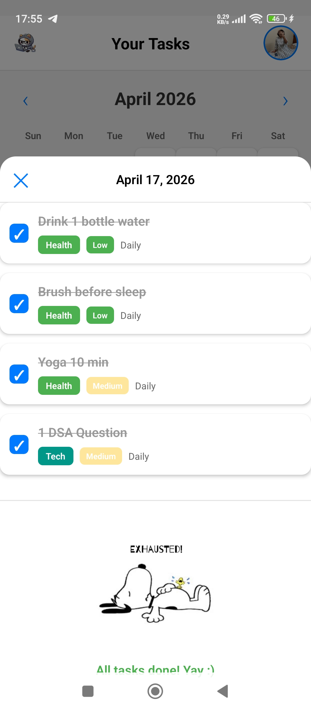
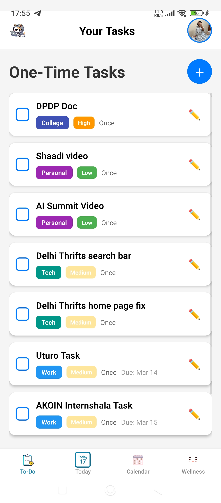
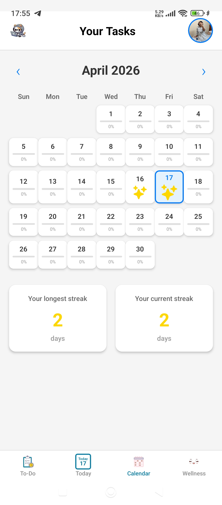
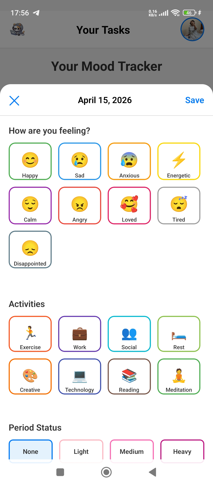
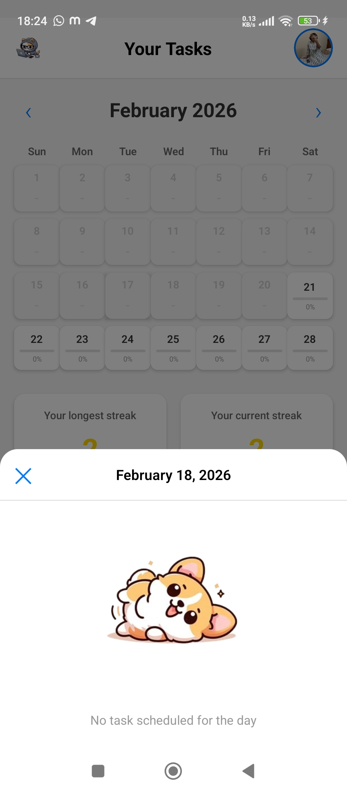

# Kitty To Do 🐱

A delightful task management app with a cute cat theme! Built with [Expo](https://expo.dev) and React Native.

## Quick Start

1. Install dependencies:

   ```bash
   npm install
   ```

2. Create your environment file from the template:

   ```bash
   cp .env.example .env
   ```

   On Windows PowerShell:

   ```powershell
   Copy-Item .env.example .env
   ```

3. Fill `.env` with your Firebase + Google credentials.

4. Start the app:

   ```bash
   npx expo start
   ```

5. Choose how to run:
   - [Development build](https://docs.expo.dev/develop/development-builds/introduction/)
   - [Android emulator](https://docs.expo.dev/workflow/android-studio-emulator/)
   - [iOS simulator](https://docs.expo.dev/workflow/ios-simulator/)
   - [Expo Go](https://expo.dev/go) - Limited sandbox for app testing

## App Screenshots

### Preview

<table>
   <tr>
      <td></td>
      <td></td>
      <td></td>
   </tr>
   <tr>
      <td></td>
      <td></td>
      <td></td>
   </tr>
</table>

You can start developing by editing files inside the **app** directory. This project uses [file-based routing](https://docs.expo.dev/router/introduction).

---

## Setup Guide

### Environment Variables Setup

Use environment variables to securely store Firebase credentials and Google OAuth configuration.

#### Recommended Setup Flow

1. Copy the template file:

   ```bash
   cp .env.example .env
   ```

   On Windows PowerShell:

   ```powershell
   Copy-Item .env.example .env
   ```

2. Replace placeholder values in `.env` with your real project credentials.
3. Restart Expo after updating env values.

#### Getting Your Credentials

**Firebase Credentials:**

1. Go to [Firebase Console](https://console.firebase.google.com/)
2. Select your project
3. Click **Project Settings** (gear icon)
4. Scroll down to **"Your apps"**
5. Click on your **Web app**
6. Copy all values from the `firebaseConfig` object

**Google Web Client ID:**

1. In **Project Settings** → **"OAuth consent screen"** → **"Credentials"**
2. Find your Web Client ID (looks like: `123456789-abc123.apps.googleusercontent.com`)

#### `.env` Variables Required

The required keys are already listed in `.env.example`:

- `EXPO_PUBLIC_FIREBASE_API_KEY`
- `EXPO_PUBLIC_FIREBASE_AUTH_DOMAIN`
- `EXPO_PUBLIC_FIREBASE_PROJECT_ID`
- `EXPO_PUBLIC_FIREBASE_STORAGE_BUCKET`
- `EXPO_PUBLIC_FIREBASE_MESSAGING_SENDER_ID`
- `EXPO_PUBLIC_FIREBASE_APP_ID`
- `EXPO_PUBLIC_FIREBASE_MEASUREMENT_ID`
- `EXPO_PUBLIC_GOOGLE_WEB_CLIENT_ID`

**Note:** `.env` should never be committed to git. Keep using `.env.example` as the shared template.

**Important:** All variables must start with `EXPO_PUBLIC_` to be accessible in your Expo app!

#### Security Best Practices

**DO:**

- Keep `.env` on your local machine only
- Add `.env` to `.gitignore` (already done)
- Share `.env.example` with team members as a template
- Use different Firebase projects for dev/prod
- Rotate keys periodically

**DON'T:**

- Commit `.env` to git
- Share your actual `.env` file
- Use the same Firebase project for testing and production
- Hardcode credentials in code

#### Testing Your Setup

1. Fill in your `.env` file with real credentials
2. Start the dev server:
   ```bash
   npx expo start
   ```
3. Open the app on a device/simulator
4. You should see the sign-in modal with the working cat
5. Tap "Sign in with Google" to test authentication

---

### Google OAuth & Firebase Setup

Google OAuth has been integrated into your Kitty To Do app. Users will see a sign-in modal when the app loads if they're not authenticated.

#### Firebase Console Setup

1. Go to [Firebase Console](https://console.firebase.google.com/)
2. Select your project (or create a new one)
3. Go to **Project Settings** (gear icon)
4. Scroll down to "Your apps" and add an Android/iOS app

#### Enable Google Sign-In

1. In Firebase Console, go to **Authentication** → **Sign-in method**
2. Click on **Google** provider
3. Click **Enable**
4. Set a support email
5. Click **Save**

#### Android Setup (for Android builds)

1. Generate native Android files:

   ```bash
   npx expo prebuild --platform android
   ```

2. Get SHA-1 certificate fingerprint:

   ```bash
   cd android
   ./gradlew signingReport
   ```

3. Add SHA-1 to Firebase:
   - Go to **Firebase Console** → **Project Settings** → **Your apps**
   - Click on your Android app
   - Add the SHA-1 certificate fingerprint

4. Download `google-services.json`:
   - In Firebase Console, download the updated file
   - Place it in `android/app/` directory

#### iOS Setup (for iOS builds)

1. Download `GoogleService-Info.plist`:
   - Go to **Firebase Console** → **Project Settings** → **Your apps**
   - Click on your iOS app
   - Download the plist file
   - Place it in the `ios/` directory

2. Add URL schemes:
   - Open `ios/KittyToDo/Info.plist`
   - Add your reversed client ID as a URL scheme

#### Features Implemented

- **Sign-In Modal** - Appears automatically when app loads if not authenticated
- **Auth Context** - Manages authentication state globally with `useAuth()` hook
- **Sign-Out Feature** - Sign-out button in the Tasks screen header with confirmation
- **Protected Routes** - App content only accessible after authentication
- **Loading Screen** - Shows while checking authentication state with cat animation
- **Error Handling** - User-friendly error messages during sign-in

#### Testing Authentication

1. Run the app:

   ```bash
   npx expo start
   ```

2. Test sign-in flow:
   - App should show the sign-in modal
   - Tap "Sign in with Google"
   - Complete Google authentication
   - You should be redirected to the main app

3. Test sign-out:
   - Tap "Sign Out" button in tasks screen
   - Confirm sign-out in the dialog
   - Sign-in modal should appear again

#### Troubleshooting

**"Sign-in failed" error**

- Check Web Client ID (use Web Client ID, not Android/iOS client ID)
- Verify Google Sign-In is enabled in Firebase Console → Authentication

**"Developer Error" on Android**

- Make sure you added the SHA-1 to Firebase
- Ensure `google-services.json` is in the correct location and up-to-date

**User is null after sign-in**

- Verify all Firebase config values in `.env` are correct
- Make sure `onAuthStateChanged` is working properly
- Check browser console for any errors

**hasPlayServices error**

- Update Google Play Services on your device
- Verify you're on a real Android device with Play Services (emulator may not work)

---

## Building APK

### For Testing (Preview)

```bash
npx expo prebuild --clean
eas build --platform android --profile preview
```

### For Production

```bash
eas build --platform android --profile production
```

### Local Build

```bash
npx expo prebuild --platform android
cd android
./gradlew assembleRelease
```

The APK will be generated at: `android/app/build/outputs/apk/release/app-release.apk`

---

## Learn More

To learn more about developing your project with Expo:

- [Expo documentation](https://docs.expo.dev/) - Learn fundamentals and advanced topics
- [Learn Expo tutorial](https://docs.expo.dev/tutorial/introduction/) - Step-by-step guide
- [Firebase Docs](https://firebase.google.com/docs/auth) - Firebase Authentication documentation
- [Expo on GitHub](https://github.com/expo/expo) - View open source platform and contribute
- [Discord community](https://chat.expo.dev) - Chat with Expo users and ask questions

---

## Fresh Project

When you're ready to start fresh, run:

```bash
npm run reset-project
```

This command will move the starter code to the **app-example** directory and create a blank **app** directory.

---

## Project Features

- **Google Authentication** - Sign in with Google using Firebase
- **Task Management** - Create, update, and delete tasks
- **Mood Tracker** - Track your daily moods with color-coded calendar
- **Activity Logging** - Log activities and wellness data
- **Real-time Sync** - Data synced to Firebase Firestore
- **Error Boundary** - Graceful error handling with user feedback
- **MIUI Optimization** - Tested and optimized for MIUI devices
- **Responsive Design** - Works on phones and tablets
- **Beautiful UI** - Modern design with cat-themed branding

---

## Support

If you need help or have issues:

1. Check the relevant section above (Setup Guide, Firebase Setup, MIUI Troubleshooting)
2. Check error messages from the Error Boundary in the app
3. Review Firebase Console for any warnings or errors
4. Check your network connection and internet access
5. Refer to [Expo Discord](https://chat.expo.dev) community for additional help
